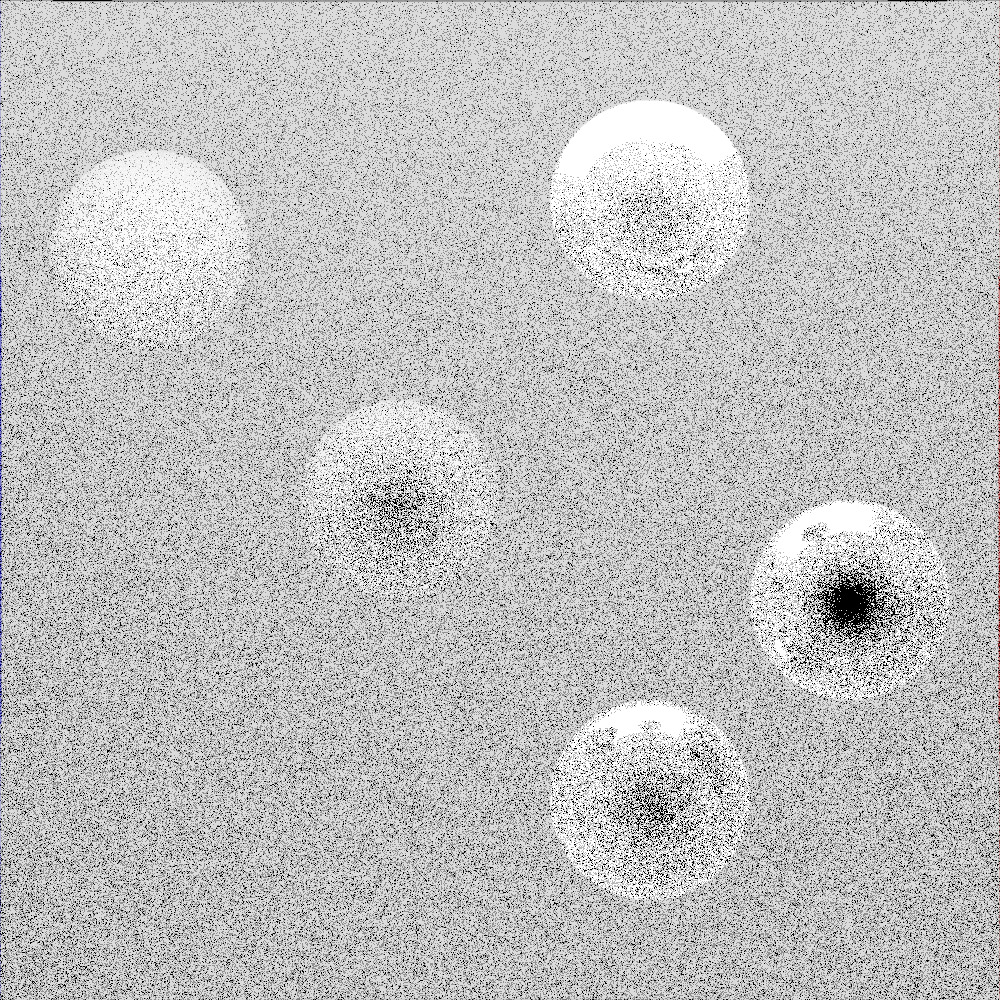

#Global Illumination

##Introduction

This is a simple global illuminator developed based on the principle of ray tracing technology with C/C++. 

The outcome of the global illumination can be seen in the following image:

Detail explanation (In Chinese) of this project and its source code can be viewed in: https://blog.csdn.net/qq_29169285/article/details/117327116

