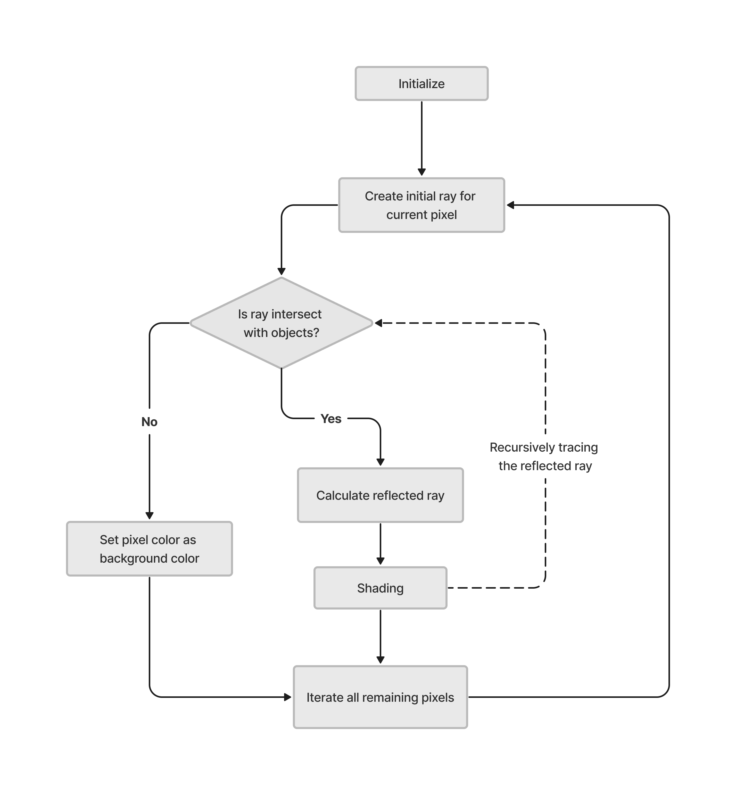

# Global Illumination

## Introduction

This is a simple global illuminator developed based on the principle outlined in *Chapter 4: Ray Tracing* from the book *Fundamentals of Computer Graphics: Second Edition*. 

Based on the theories presented in the book, a basic **ray tracing** algorithm was implemented for rendering and the **Phong-Blinn shading model** is adopted for shading. This global illuminator is developed by C/C++


Read this in other languages:
[简体中文](https://blog.csdn.net/qq_29169285/article/details/117327116)

The outcome of the global illumination can be seen in the following image. There are five spheres in a closed room (The wall that at the same position of users' screen has no color). The light source is at the top of the room. The sphere on the right-top corner and the two spheres on the right-down corner use smooth material, while the rest of the spheres use rough material.


<br></br>

## Catalog

+ [Ray Tracing Basic](#RayTracing)


<br></br>
<a id="RayTracing"></a>

# Ray Tracing Basic

To explain ray tracing, it's first necessary to understand how light forms images. Taking photography as an example, the process of forming a photograph can be simplified as follows: A light source emits countless rays in all directions. If these rays encounter an object in their path, they will reflect or refract at the point of intersection and then continue in the direction of reflection. A portion of the light rays emitted by the source will, after multiple reflections, ultimately land on the camera's photosensitive film. The totality of the light rays received by the film constitutes the final captured image.

In essence, photography maps a three-dimensional scene onto a two-dimensional image. Computer imaging is similar to photographic imaging, but computers cannot simulate the real-world process of photographic imaging. Even the smallest light source emits countless rays in all directions, making it impossible for computers to track and calculate the final destination of every single ray.

However, the number of rays involved in forming an image is limited and known, as the size of the imaging surface is fixed, and each pixel corresponds to a single ray. Therefore, the number of rays is equal to the number of pixels. If we reverse the process of photographic imaging, starting from the imaging surface and retracing the path of the rays back to the source, we can simulate the imaging process in reverse. Although computationally intensive, this process, known as 'Ray Tracing,' is within the capabilities of modern computers.

## Ray Tracing Algorithm

Based on the ray tracing principles described above, we can derive the proposed framework for ray tracing, summarized in pseudo-code as:

```java
for each pixel do :
    compute viewing ray
    if (ray hits an object) then :
        get hit object ID
        compute reflected ray 
        evaluate shading model
        recursively trace ray back until stop
        set pixel to shading color
    else :
        set shading color to background color
```


And the flowchat of the ray tracing process is like:

