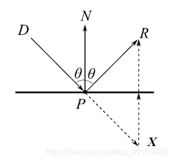
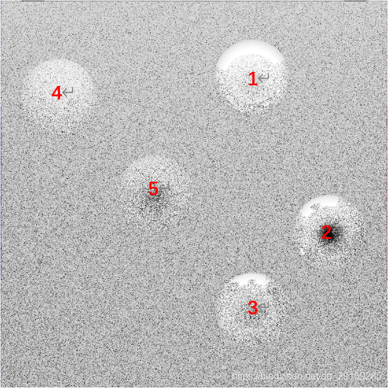

# Global Illumination

## Introduction

This is a simple global illuminator developed based on the principle outlined in *Chapter 4: Ray Tracing* from the book *Fundamentals of Computer Graphics: Second Edition*. 

Based on the theories presented in the book, a basic **ray tracing** algorithm was implemented for rendering and the **Phong-Blinn shading model** is adopted for shading. This global illuminator is developed by C/C++


Read this in other languages:
[简体中文](https://blog.csdn.net/qq_29169285/article/details/117327116)

The outcome of the global illumination can be seen in the following image. There are five spheres in a closed room (The wall that at the same position of users' screen has no color). The light source is at the top of the room. The sphere on the right-top corner and the two spheres on the right-down corner use smooth material, while the rest of the spheres use rough material.

<p align="center">  </p>


<br></br>

## Catalog

+ [Ray Tracing Basic](#RayTracing)

+ [Initialize Ray](#InitializeRay)

+ [Ray Intersection](#RayIntersection)

+ [Ray Reflection](#RayReflection)

+ [Shading Model](#ShadingModel)

+ [Demos](#Demos)


<br></br>
<a id="RayTracing"></a>

# Ray Tracing Basic

To explain ray tracing, it's first necessary to understand how light forms images. Taking photography as an example, the process of forming a photograph can be simplified as follows: A light source emits countless rays in all directions. If these rays encounter an object in their path, they will reflect or refract at the point of intersection and then continue in the direction of reflection. A portion of the light rays emitted by the source will, after multiple reflections, ultimately land on the camera's photosensitive film. The totality of the light rays received by the film constitutes the final captured image.

In essence, photography maps a three-dimensional scene onto a two-dimensional image. Computer imaging is similar to photographic imaging, but computers cannot simulate the real-world process of photographic imaging. Even the smallest light source emits countless rays in all directions, making it impossible for computers to track and calculate the final destination of every single ray.

However, the number of rays involved in forming an image is limited and known, as the size of the imaging surface is fixed, and each pixel corresponds to a single ray. Therefore, the number of rays is equal to the number of pixels. If we reverse the process of photographic imaging, starting from the imaging surface and retracing the path of the rays back to the source, we can simulate the imaging process in reverse. Although computationally intensive, this process, known as 'Ray Tracing,' is within the capabilities of modern computers.

## Ray Tracing Algorithm

Based on the ray tracing principles described above, we can derive the proposed framework for ray tracing, summarized in pseudo-code as:

```java
for each pixel do :
    compute viewing ray
    if (ray hits an object) then :
        get hit object ID
        compute reflected ray 
        evaluate shading model
        recursively trace ray back until stop
        set pixel to shading color
    else :
        set shading color to background color
```

And the flowchat of the ray tracing process is like:

<p align="center">  </p>


<br></br>
<a id="InitializeRay"></a>

# Initialize Ray

To generate rays, a mathematical representation of the ray is essential. A ray is a directed line originating from a light source. Based on this principle, any ray in mathematics can be represented by its origin point and direction of propagation. The following formula can be derived:

$$\vec{P(t)} = \vec{e} + t \cdot \vec{d}  \qquad  t\in(0,\infty) \tag{1}$$

Where $\vec{e}$ is the three-dimensional coordinate of the ray's origin, $\vec{d}$ is the direction vector of the ray, and $t$ is a scalar representing the distance from the origin point along the direction $\vec{d}$. This formula represents a point on the path of the ray at a distance $t$ from the origin, and the total collection of all such points along the path constitutes the ray itself.

With the mathematical expression for a ray established, we can then calculate the initial position and direction of the ray. However, these values are not arbitrarily set; determining them involves another crucial aspect - the issue of viewpoint.

In the field of computer graphics, there are primarily two types of viewpoints: **Orthographic View** (also known as Parallel View) and **Perspective View**. In an Orthographic View, the imaging of objects is mapped onto corresponding pixels in a way that is perpendicular to the imaging surface. Therefore, all initial rays have the same direction perpendicular to the imaging surface, with their origins at their respective pixels on the imaging surface.

In contrast, the Perspective View is more akin to human eye imaging. All initial rays originate from a single point, often referred to as the **Viewing Point**. The imaging surface is located in front of the Viewing Point, and all initial rays emanate from this point, passing through their respective pixels on the imaging surface. Therefore, in a Perspective View, the directions of the rays are varied and radiate outward. The differences in the initial rays between these two viewpoints can be seen in the comparison illustrated below:

<p align="center">  </p>
<p align="center"> <font size=3 color=grey>Figure 2: orthographic view and perspective view </font> </p>

Hence, for any given pixel point $\vec{p}=(x,y,z)$, the initial ray in an Orthographic View can be expressed as:

$$ray.position = \vec{p}$$

$$ray.direction = -\vec{w} \tag{2}$$

In a Perspective View, the initial ray can be expressed as:

$$ray.position = \vec{e}$$ 

$$ray.direction = -d*\vec{w} \ + \ x*\vec{u} \ + \ y*\vec{v}$$

Where $\vec{p}$ represents the three-dimensional coordinates of the pixel point, and $\vec{u}, \ \vec{v}, \ \vec{w}$ are unit vectors representing right, up, and outward directions based on the coordinate system established by the imaging surface. $\vec{e}$ is the three-dimensional coordinate of the viewing point, and $d$ is the distance from the viewing point to the imaging surface.

For ease of calculation, the algorithm in this project adopts the Orthographic View.


<br></br>
<a id="RayIntersection"></a>

# Ray Intersection

A second key issue to address in ray tracing is determining whether the ray intersects with any objects in space. Similarly, we need to establish a mathematical expression for objects in three-dimensional space to facilitate further calculations.

In the current field of computer graphics, the handling of ray-object intersections is primarily focused on spheres and triangular faces. The choice of spheres is straightforward, but why triangular faces? Triangular faces are the most lightweight mathematical representation of three-dimensional planes, as any polyhedral surface can be composed of several triangular faces. By extension, any object in three-dimensional space (including spheres) can be constructed from multiple triangular faces. Thus, by combining triangular faces, we can represent any object in space.

However, some detailed models can consist of thousands, or even tens of thousands, of triangular faces. Ray tracing such an object would consume a significant amount of time and computational power. For simplification purposes, the algorithm discussed in this project only involves the intersection of rays with spheres.

If the center of the sphere $C$ is known, with coordinates $(x_c, \ y_c, \ z_c)$, and the radius of the sphere is $R$, then the coordinates of any point $P$ on the sphere can be represented by the following formula:

$$(x-x_c)^2 \ + \ (y-y_c)^2 \ + \ (z-z_c)^2 = R^2$$

or direct vector expression:

$$(\vec{P}-\vec{C}) \cdot (\vec{P}-\vec{C}) = R^2  \tag{3}$$

All points on the surface of a sphere collectively constitute the sphere itself. The intersection of a ray with a sphere is, in fact, the intersection of the ray with a specific point on the sphere. From the previous section, we have obtained the expression for a ray. Substituting Equation (1) into Equation (3), we derive the expression for the intersection point as:

$$(\vec{e} + t \cdot \vec{d}-\vec{C}) \cdot (\vec{e} + t \cdot \vec{d}-\vec{C}) - R^2 = 0   \tag{4}$$

Further simplification yields:

$$(\vec{d} \cdot \vec{d})*t^2 + (\vec{e}-\vec{C}) \cdot \vec{d}*2t + (\vec{e}-\vec{C}) \cdot (\vec{e}-\vec{C}) - R^2 = 0  \tag{5}$$

This expression is a quadratic equation in terms of $t$, where “$\cdot$” denotes the dot product and “$*$” denotes scalar multiplication. The coefficients $a$, $b$, and $c$ of the quadratic equation are respectively:

$$a = (\vec{d} \cdot \vec{d})$$

$$b =  (\vec{e}-\vec{C}) \cdot \vec{d}*2$$

$$ c = (\vec{e}-\vec{C}) \cdot (\vec{e}-\vec{C}) - R^2$$

The solutions for $t$ obtained from this equation represent the distance from the ray's origin to the intersection point. It's important to note that $t$ cannot be negative (a negative value implies that the ray is emanating in the opposite direction, contradicting $\vec{d}$), and its value should also be bounded within a certain range, not extending to positive infinity. Finally, the smaller value of $t$ should be chosen, as a ray passing through a sphere will have two intersection points. Only the one closer to the ray's origin represents the actual intersection point.


<br></br>
<a id="RayReflection"></a>

# Ray Reflection

After the initial ray intersects with an object, it doesn’t simply stop. Instead, it undergoes reflection or refraction based on the material properties of the object. 

There are two types of reflections: **specular** (mirror-like) and **diffuse**. Specular reflection is relatively straightforward: when a ray intersects an object at a certain angle, the reflected ray exits at the same angle. As illustrated below, to find the direction of the reflected ray, $\vec{PR}$, we can use $\vec{PX}+\vec{XR}$. Here, $\vec{PX}$ is derived from the incident ray’s direction $\vec{DP}$, and $\vec{PN}$ is the surface's normal vector.

$$\vec{XR} = 2(\vec{PD} * \cos{\theta}) = 2(-\vec{DP} * \cos{\theta}) = -2(\vec{DP} \cdot \vec{PN})/(\vert\vec{DP}\vert * \vert\vec{PN}\vert)$$

Since $\vec{DP}, \ \vec{PN}, \ \vec{PR}$ are all unit vectors, the direction of the reflected ray can be determined as:

$$\vec{PR}=\vec{DP}-2(\vec{DP} \cdot \vec{PN})   \tag{6}$$

<p align="center">  </p>
<p align="center"> <font size=3 color=grey> Figure 3: schematic of specular eeflection </font> </p>

The primary difference between diffuse and specular reflections is that the angles of incidence and reflection are not the same for diffuse reflections. As a result, in ray tracing algorithms, the direction of the reflected ray is typically generated randomly. To randomly generate the outgoing ray, we first need to establish an orthogonal coordinate system for it. The normal vector of the plane, $\vec{n}$, serves as the first axis of this coordinate system. The second axis, which should be perpendicular to the normal vector, can be obtained by crossing a unit vector with the normal vector:

$$\vec{u} = \vec{n} \times \vec{vec}$$

The third axis needs to be perpendicular to both the first and second axes, and can therefore be obtained by crossing the first and second axes:

$$\vec{v} = \vec{n} \times \vec{u}$$

Finally, as all three axes are unit vectors, the randomly generated reflected ray can be determined by randomly setting the extent of the ray along each axis.


<br></br>
<a id="ShadingModel"></a>

# Shading Model

Merely calculating the intersection of rays with objects is insufficient for rendering a complete image; it is also necessary to color the image based on the objects' colors. This process requires establishing a shading model.

The simplest shading model was proposed in the 18th century by Lambert, based on everyday observations. He suggested that the amount of light gathered on a unit area of a surface depends on the angle at which light enters the surface. From this observation, Lambert developed the **Lambertian shading model**:

$$L = k_d * I * max(0, \vec{n} \cdot \vec{l}) \tag{7}$$

Here, $k_d$ is the diffuse reflection coefficient, $I$ represents the light source, $\vec{n}$ and $\vec{l}$ are the normal vector of the surface and the direction of the reflected light, respectively (in ray tracing, the direction of the reflected light represents the direction of light emitted from the source). $L$ is the color of the current pixel, which can be a scalar or a vector (if using a three-channel vector to represent RGB color).

However, the illumination model depicted by this method is quite rudimentary, producing almost uniform color across an object without highlights or variations in light and shadow. To address this, Phong and Blinn proposed in 1975 that the closer the angle bisector of the incident and reflected rays is to the normal of the surface, the more light the surface reflects. Therefore, based on the Lambertian model, the **Phong-Blinn shading model** evolved:

$$L = k_d * I * max(0, \vec{n} \cdot \vec{l}) + k_s * I * max(0, \vec{n} \cdot \vec{h})^p \tag{8}$$ 

$$\vec{h} = (\vec{v} \cdot \vec{l})/\Vert\vec{v}+\vec{l}\Vert$$

Here, $k_s$ is the specular reflection coefficient, $\vec{h}$ is the bisector of the angles of the incident and reflected rays, and $p$ is the Phong exponent, which controls the amount of reflected light and must be greater than 1. The smaller the value of $p$, the closer the reflection mechanism is to diffuse reflection; the larger the value of $p$, the closer it is to specular reflection.


<br></br>
<a id="Demos"></a>

# Demos

<p align="center">  </p>
<p align="center"> <font size=3 color=grey> Figure 4: Final Result </font> </p>

Among the result image, spheres 1, 2, and 3 are specular material, and spheres 4 and 5 are diffuse material.

<p align="center">  </p>
<br>

It is evident that the sphere with a specular material reflects the light source located at the top very well. Upon closer inspection, reflections of other spheres can also be observed.

If we closely observe Sphere 2, the spots indicated by the red arrow are reflections of Sphere 1. The highlights pointed out by the yellow arrow are reflections of the highlights from Sphere 3 on Sphere 2. The dark spot marked by the blue arrow is due to its facing towards the front wall, which is colored black, hence creating a black spot on Sphere 2.

<p align="center">  </p>
<br>

Upon closely observing Sphere 3, the spot indicated by the red arrow is the reflection of Sphere 1. The spot pointed out by the yellow arrow is the reflection of Sphere 5. Meanwhile, the spot marked by the blue arrow is the reflection of Sphere 2.

<p align="center">  </p>
<br>

We can also observe that Sphere 4, being closer to the light source than Sphere 5, appears brighter than Sphere 5.

Overall, this algorithm effectively implements the basic functions of ray tracing. With increased sampling, additional recursion layers, and expanded imaging area, along with further upgrades to the shading model, even better rendering results can be achieved.

To further improve from an algorithmic perspective, the Monte Carlo method for ray tracing should be employed. This is a widely used ray tracing algorithm capable of rendering global illumination scenes with greater accuracy. I plan to further research in this direction in the future.

The only shortcoming in the current rendering is that, according to the original algorithm settings, the generated image should be in full RGB color. However, for some unknown reason, the final PPM file, when converted to a PNG image, lost all color data and only retained black and white. Resolving this issue would better allow us to analyze whether the algorithm can accurately depict the scene as it is and evaluate the strengths and weaknesses of the algorithm itself.


<br></br>

# Reference

Peter, S., Steve, 	M. (2009). *Fundamentals of Computer Graphics (3rd Edition)* 

Kevin, B. (2010). *[Smallpt: Global Illumination in 99 lines of C++](http://www.kevinbeason.com/smallpt/)*. Retrieved from: http://www.kevinbeason.com/smallpt/

Eric, Y. personal communication. May, 28, 2021 